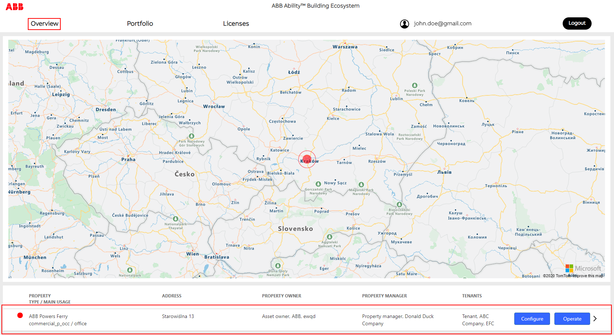
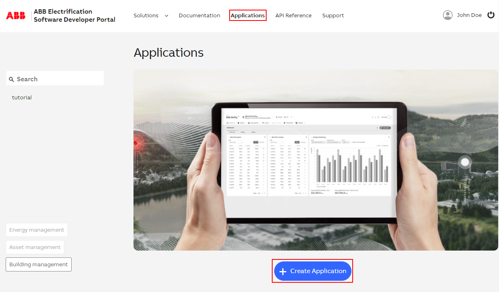
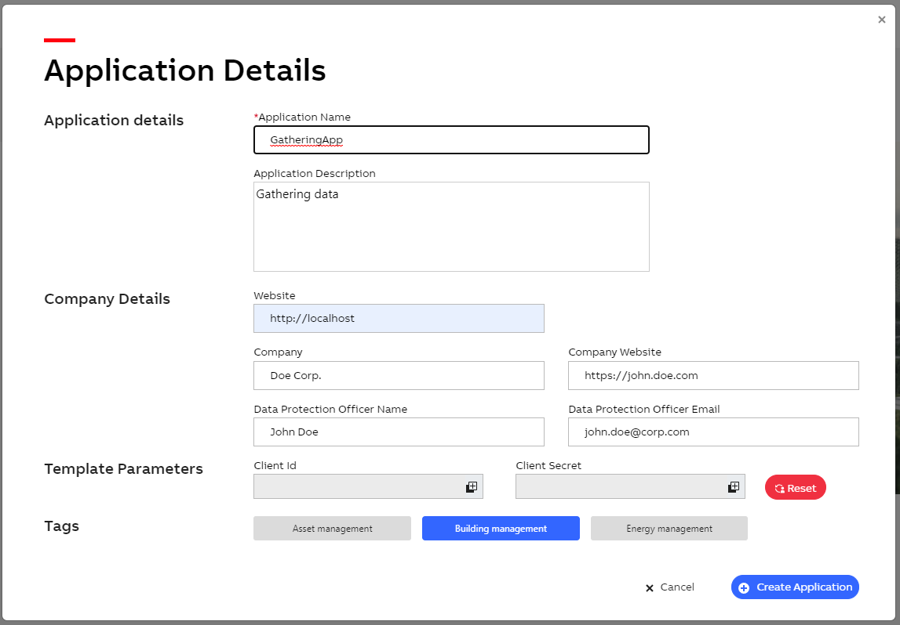
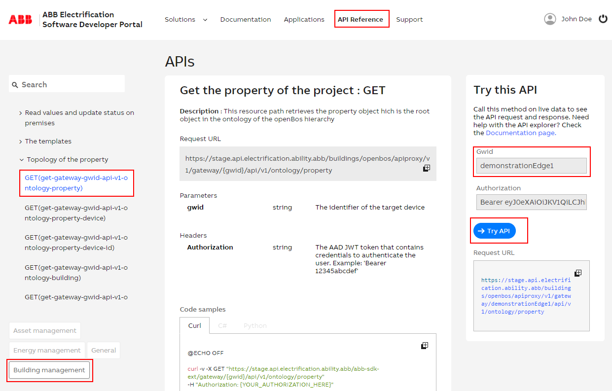

# Table of contents
- Prerequisites
  - [How to connect a Building edge openBOS&reg; device to ABB cloud and get ready to using the open APIs?](#how-to-connect-a-building-edge-openbos-device-to-abb-cloud-and-get-ready-to-using-the-open-apis)
- Environment
  - [Postman environment](#postman-environment)
  - [Swagger environment](#swagger-environment)
- Concept
  - [One app for local and cloud use](content/30_concept/010_uniqueApp.md)
  - [Basic objects](content/30_concept/10_basicObjects.md)
  - [Several levels of accessibility](content/30_concept/020_accessLevel.md)
  - [Accessing a Building edge via the Cloud API](content/30_concept/035_cloud_access.md)
  - [Connection and authentication](content/30_concept/030_authentication.md)
  - [Tags: a core concept to understand](content/30_concept/040_tags.md)
  - [Basic rules for API endpoints and DTOs](content/30_concept/050_routes.md)
  - [Users objects](content/30_concept/060_usersObjects.md)
  - [A pure template concept](content/30_concept/120_template.md)
  - Property objects
    - [Building space ontology concept](content/30_concept/070_buildingSpace.md)
    - [Building asset management](content/30_concept/080_buildingAsset.md)
    - [Building Datapoints management](content/30_concept/090_datapoints.md)
  - [Physical device management](content/30_concept/100_physicalDevice.md)
  - [Handle automation functions](content/30_concept/110_automation.md)
  - [Event driven subscription to prevent from polling](content/30_concept/130_eventDriven.md)   
- Samples
  - [How to authenticate from cloud](content/40_samples/10_authenticateToCloud.md)
  - [How to display property users?](content/40_samples/20_checkUsers.md)
  - [How to get information on the property?](content/40_samples/30_discoverProperty.md)
  - [Switch on lights of a specific office in a building?](content/40_samples/40_switchOnLights.md)
  - [How to read a DataPoint ?](content/40_samples/60_manageDatapoints.md#how-to-read-a-datapoint)
  - [How to write a DataPoint value ?](content/40_samples/60_manageDatapoints.md#how-to-write-a-datapoint-value)
  - [How do I subscribe to any datapoint value change ?](content/40_samples/60_manageDatapoints.md#how-do-i-subscribe-to-any-datapoint-value-change)
  - [How do I manage alarms ?](content/40_samples/50_manageAlarms.md)
  - [How do I read trend value ?](content/40_samples/70_manageTrends.md)
- References
  - [Ontology basics objects](content/60_references/10_basicObjects.md)
  - [Ontology Template objects](content/60_references/20_templateObjects.md)
  - [Ontology Instances objects](content/60_references/30_instancesObjects.md)
  - [Ontology users objects](content/60_references/40_usersObjectsTags.md)
  - [Ontology building spaces](content/60_references/50_buildingSpacesTags.md)
  - [Ontology datapoints objects](content/60_references/60_datapointsTags.md)
  - [Ontology assets objects](content/60_references/70_assetsTags.md)
- Appendix
  - [Glossary](content/70_appendix/10_glossary.md)

# How to connect a Building edge openBOS device to ABB cloud and get ready to using the open APIs?

## Prerequisites
These steps have to be performed before starting to use the openBOS&reg; APIs:

1.	Register for a free myABB account
    - Directly here: <a href="https://www.usermanagement.abb.com/account/Register" target="_blank">https://www.usermanagement.abb.com/account/Register</a>
    - Or on <a href="https://developers.connect.abb.com/getting-started" target="_blank">https://developers.connect.abb.com/getting-started</a> following the “Register” button
2.	Ensure you have an openBOS&reg; Building edge gateway which is
    - set up physically in your building
    - commissioned via the local web interface / tool
    - connected to a myABB account
3.	Create a local user on your Building edge device
    - which has the rights to use the Cloud and API
    - which has the same email address as the myABB account you are using
4.	Make sure that your Building edge device is registered and equipped with the right licenses here: <a href="https://buildings.ability.abb" target="_blank">https://buildings.ability.abb</a>

Visit <a href="https://buildings.ability.abb/portfolio" target="_blank">https://buildings.ability.abb/portfolio</a> by logging into the page via your myABB account.

Here you find your openBOS&reg; Building edge / gateway and you may configure and manage it.

## Create a new application in the ABB Developer Portal
Log into the ABB Developer Portal with your myABB credentials
 - <a href="https://developers.connect.abb.com/getting-started" target="_blank">https://developers.connect.abb.com/getting-started</a>

- Click on Applications and press Create Application

- Enter the necessary data for your application and your preferred redirect URLs
  - Be sure that you select the option "Building Management"
  - Press Create Application

 - After the application has been successfully created, you can find your required data to access the API for the first time

 - You can try out our API right away inside our ABB Developer Portal in section “API reference”
   - Click on “Building Management“ tag at the bottom of the left side
   - Select an endpoint to be called on the left side
   - Set the edge identifier to communicate with.(NOTE : Use `demonstrationEdge1` to Try Out against the demonstration edge)
   - Click “Try out”

Start using your first calls to get data from openBOS&reg;.

# Postman environment

You will find below Postman environments.
One configured to target a local edge and one configured to target an edge through the cloud.

## Local environment

 <a href="assets/openbos-documentation/static/images/openBOS Ontology Local Api.postman_collection.json" target="_blank">Download openBOS Postman API collection for local</a>

 - Open Postman and import the collection
 - Select the imported collection
 - Click on `...` and select `Edit`
 - Navigates to the Variables definition tab
 - Change the `{{baseUrl}}` to the address of your edge locally accessible
 - Select the route POST - Get Authentication token
   - Edit the body and set your credentials
   - Press Send
     - If OK then the token will be stored for subsequent calls
 - You can then select other routes to test them

## Cloud environment

 <a href="assets/openbos-documentation/static/images/openBOS Ontology Cloud Api.postman_collection.json" target="_blank">Download openBOS Postman API collection for cloud</a>

 - Retrieve the gwid of your edge from the cloud portal
   - Connect to <a href="https://buildings.ability.abb/portfolio" target="_blank">https://buildings.ability.abb/portfolio</a>
   - Click on the detail of an edge to extract its unique identifier (aka: `gwid`)
 - Open Postman and import the collection
 - Select the new imported collection
 - Click on `...` and select `Edit`
   - Select the `Authorization` tab
   - Set the Client ID to the one that matches the application you have created in the cloud developer portal. (Refers to documentation "How to connect a SmartEdge openBOS device to ABB cloud and get ready to using the open APIs?" for more details)
   - Select the Variable tab
   - Set the `gwid` to the id you retrieved from the step above.
   - Comeback to the `Authorization` tab
   - Scroll down and press `Get New Access Token`
   - Follow the authentication step
 - You can then select other routes to test them

# Swagger environment

 - Work in progress