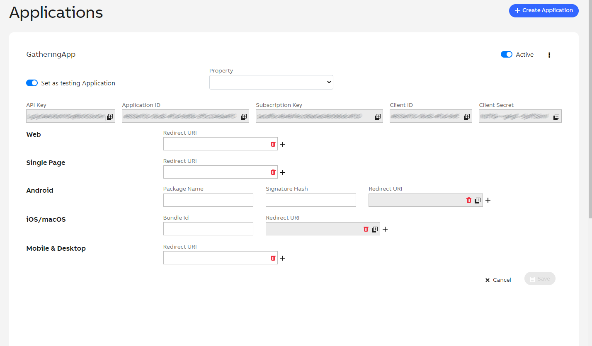

# Table of contents
- Prerequisites
  - [How to connect a Building edge openBOS&reg; device to ABB cloud and get ready to using the open APIs?](#how-to-connect-to-a-building-edge)
- Environment
  - [Postman environment](#how-to-start-with-postman)
- Concept
  - [One app for local and cloud use](content/30_concept/010_uniqueApp.md)
  - [Several levels of accessibility](content/30_concept/020_accessLevel.md)
  - [Accessing a Building edge via the Cloud API](content/30_concept/035_cloud_access.md)
  - [Connection and authentication](content/30_concept/030_authentication.md)
  - [Tags: a core concept to understand](content/30_concept/040_tags.md)
  - [Basic objects](content/30_concept/050_basicObjects.md)
  - Property objects
    - [Building space ontology concept](content/40_mainObjects/070_buildingSpace.md)
    - [Building asset management](content/40_mainObjects/080_buildingAsset.md)
    - [Building Datapoints management](content/40_mainObjects/090_datapoints.md)
  - [Physical device management](content/40_mainObjects/100_physicalDevice.md)
  - [Handle automation functions](content/40_mainObjects/110_automation.md)
    - [Alarm functions](content/40_mainObjects/111_alarms.md)
    - [Trends functions](content/40_mainObjects/112_trends.md)
    - [Schedulers functions](content/40_mainObjects/113_schedules.md)
  - [Event driven subscription to prevent from polling](content/30_concept/130_eventDriven.md)   
  - [Advanced filtering for collections](content/40_mainObjects/140_advancedFiltering.md)   
- Samples
  - [How to authenticate from cloud](content/50_samples/10_authenticateToCloud.md)
  - [How to display property users?](content/50_samples/20_checkUsers.md)
  - [How to get information on the property?](content/50_samples/30_discoverProperty.md)
  - [How to get buildings available in a property?](content/50_samples/30_discoverProperty.md#how-to-get-buildings-available-in-a-property)
  - Datapoints
    - [The different type of datapoint](content/50_samples/40_manageDatapoints.md#the-different-type-of-datapoint)
    - [How to read a DataPoint ?](content/50_samples/40_manageDatapoints.md#how-to-read-a-datapoint)
    - [How to write a DataPoint value ?](content/50_samples/40_manageDatapoints.md#how-to-write-a-datapoint-value)
  - [How do I subscribe to any datapoint value change ?](content/50_samples/40_manageDatapoints.md#how-do-i-subscribe-to-any-datapoint-value-change)
  - [Switch on lights of a specific office in a building?](content/50_samples/50_switchOnLights.md)
  - [How do I manage alarms ?](content/50_samples/60_manageAlarms.md)
  - [How do I read trend value ?](content/50_samples/70_manageTrends.md)
  - [How do I manage schedulers ?](content/50_samples/80_manageSchedulers.md)
- References
  - [Postman environment](content/60_references/10_postman.md)
  - [Ontology Instances objects](content/60_references/30_schemas.md)
  - [Ontology users tags](content/60_references/40_usersObjectsTags.md)
  - [Ontology building and spaces tags](content/60_references/50_buildingSpacesTags.md)
  - [Ontology datapoints tags](content/60_references/60_datapointsTags.md)
  - [Ontology assets tags](content/60_references/70_assetsTags.md)
- Appendix
  - [Glossary](content/70_appendix/10_glossary.md)

# How to connect to a Building edge?

## Prerequisites
These steps have to be performed before starting to use the openBOS&reg; APIs:

1.	Register for a free myABB account
    - Directly here: <a href="https://www.usermanagement.abb.com/account/Register" target="_blank">https://www.usermanagement.abb.com/account/Register</a>
    - Or on <a href="https://developers.connect.abb.com/getting-started" target="_blank">https://developers.connect.abb.com/getting-started</a> following the “Register” button
2.	Ensure you have an openBOS&reg; Building edge gateway which is
    - set up physically in your building
    - commissioned via the local web interface / tool
    - connected to a myABB account

Visit <a href="https://buildings.ability.abb" target="_blank">https://buildings.ability.abb</a> by logging into the page via your myABB account.

Here you find your openBOS&reg; Building edge / gateway and you may configure and manage it.

## Create a new application in the ABB Developer Portal
Log into the ABB Developer Portal with your myABB credentials
 - <a href="https://developers.connect.abb.com/getting-started" target="_blank">https://developers.connect.abb.com/getting-started</a>

- Click on Applications and press Create Application

- Enter the necessary data for your application and your preferred redirect URLs
  - Be sure that you select the option "Building Management"
  - Press Create Application

 - After the application has been successfully created, you can find your required data to access the API for the first time
 - You must configure the RedirectURI depending of the application type you will use
     - Example : for a Single Page you will have to set the RedirectURI in the Single Page textbox

The concept of RedirectURI is used in OAuth2.0 to ensure that the sensitive data of the authentication are retrieved only to a well known URI. You can find more information at [OAuth 2.0](https://www.oauth.com/oauth2-servers/redirect-uris/)

 - You can try out our API right away inside our ABB Developer Portal in section “API reference”
   - Click on “Building Management“ tag at the bottom of the left side
   - Select an endpoint to be called on the left side
   - Set the edge identifier to communicate with.(NOTE : Use `demonstrationEdge1` to Try Out against the demonstration edge)
   - Click “Try out”

Start using your first calls to get data from openBOS&reg;.

# Postman environment to test the API

NOTE: default values are to target the "demonstrationEdge1" edge.

## How to start with postman

 - Click on the Run in Postman button
 - It will fork in your workspace the openBOS postman collection

 - Authorization:
   - Click on `...` next to the imported collection and select `Edit`
     - Select the `Authorization` tab
     - Set the Client ID to the one that matches the application you have created in the cloud developer portal. (Refers to chapter "How to connect a Building Edge?" for more details)
     - Scroll down and press `Get New Access Token`
     - Follow the authentication step
     - And finally click on `Use Token` to store the token for the next calls

  - Select the target edge
    - Option 1 : Retrieve the list of edges you have in your account through API
      - In the postman collection selects the "Get my edges" entry and press "Send"
      - You will have the list of all edges that are assigned to you
      - Keep the "gatewayId" of the edge you want to connect to
    - Option 2 : Retrieve the list of edges you have in your account using the portal
      - Connect to <a href="https://buildings.ability.abb/portfolio" target="_blank">https://buildings.ability.abb/portfolio</a>
      - Click on the detail of an edge to extract its unique identifier (aka: `gatewayId`)
    - To finally set the gatewayId
     - In Postman / openBOS How tos / ... / Variables tab
     - set the variable gwid to the "gatewayId" you previously get back
     - and save
   - Comeback to the `Authorization` tab
   - Scroll down and press `Get New Access Token`
   - Follow the authentication step
  - You can then select other routes to test them