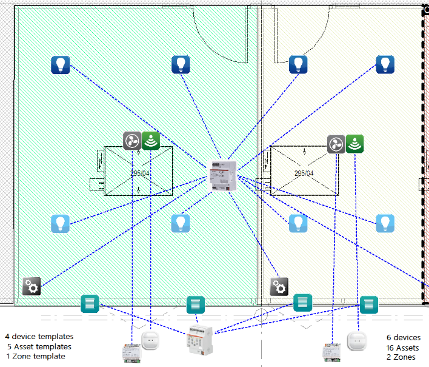

# Basic objects: DEVICE, ASSET and ZONES

openBOS&reg; manages 3 main objects in the ontology:
1. DEVICES: the physical automation devices 
2. ASSETS: the functional equipment managed by automation devices and located in spaces. 
3. ZONES: the spaces where the equipment are located. They can be physical (SPACE, STRUCTURE) or logical (AREA)

These 3 main objects are openBOS&reg; standard objects: so they are based on templates: DEVICE TEMPLATE , ASSET TEMPLATE and ZONE TEMPLATE.

Important rules to understand :
- A physical DEVICE is not linked to a ZONE
- A ZONE is a collection of ASSETs and independent from the DEVICES
- Each DEVICE manages a collection of ASSETS. Either a single or multiple.

