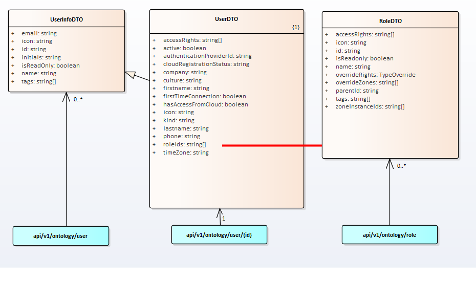

# Users objects

## General information

openBOS&reg; describes building ontology. And there are users in a building. So we offer several type of users that may have differences in roles, permissions, …. 
We are managing the stakeholder companies from ownership to use via management: Owner, Property Manager, Facility Manager, Tenant, Visitor and Administrator of the edge  
Each user belongs to a company and all his description and permissions are described and stored in the ontology.  
User capacity is defined by role base access control system: each user being linked to role, each role having permissions. 
The access rights are the possible permissions authorized for a role. 

LOCALIZATION: each user is localized and depending on the zone, HMI will change and adapt and propose the relevant unit, money, … 

## Ontology mapping

## Tags families
Main user tag families are:
| Role Name           | Description                                                     | Array JSon  Name | Property 1     |
|---------------------|-----------------------------------------------------------------|----------------------|----------------|
|                     |                                                                 |                      |                |
| System Admin        | Identifies user role as System Admin                            | ##role               | bos:info:company |
| Property Owner      | Identifies user role as Property Manager, Portfolio Manager, User   | ##role               | bos:info:company |
| Property Manager    | Identifies user role as Property Manager, Portfolio Manager, subcontractor, User, guest       | ##role               | bos:info:company |
| Facility Manager    | Identifies user role as Property Manager, Portfolio Manager, subcontractor, User, guest   | ##role               | bos:info:company |
| User                | Identifies user role as user of an property owner               | ##role               | bos:info:company |
| Tenant              | Identifies user role as Local manager, real estate manager, guest       | ##role               | bos:info:company |
| Visitor             | Identifies user role as visitor | ##role               | bos:info:company |

## Complete predefined tags list
<u>Associated tags</u>

As mentioned before, everyone working with openBOS&reg; is considered a user. These roles may be found via tags. Search a user with the associated tag:

| Tag                                       | Role Name           | Description                                                     | Array JSon  Name | Property 1     |
|-------------------------------------------|---------------------|-----------------------------------------------------------------|----------------------|----------------|
|                                           |                     |                                                                 |                      |                |
| bos:role:system_admin                       | System Admin        | Identifies user role as System Admin                            | ##role               | bos:info:company |
| bos:role:property_owner:site_manager        | Property Manager    | Identifies user role as site manager of an property owner       | ##role               | bos:info:company |
| bos:role:property_owner:portfolio_manager   | Portfolio Manager   | Identifies user role as portfolio manager of an property owner  | ##role               | bos:info:company |
| bos:role:property_owner:user                | User                | Identifies user role as user of an property owner               | ##role               | bos:info:company |
| bos:role:property_manager:site_manager      | Property Manager    | Identifies user role as site manager of a property manager      | ##role               | bos:info:company |
| bos:role:property_manager:portfolio_manager | Portfolio Manager   | Identifies user role as portfolio manager of a property manager | ##role               | bos:info:company |
| bos:role:property_manager:subcontractor     | Subcontractor       | Identifies user role as subcontractor of a property manager     | ##role               | bos:info:company |
| bos:role:property_manager:user              | User                | Identifies user role as user of a property manager              | ##role               | bos:info:company |
| bos:role:property_manager:guest             | Guest               | Identifies user role as guest of a property manager             | ##role               | bos:info:company |
| bos:role:facility_manager:site_manager      | Property Manager    | Identifies user role as site manager of a facility manager      | ##role               | bos:info:company |
| bos:role:facility_manager:portfolio_manager | Portfolio Manager   | Identifies user role as portfolio manager of a facility manager | ##role               | bos:info:company |
| bos:role:facility_manager:subcontractor     | Subcontractor       | Identifies user role as subcontractor of a facility manager     | ##role               | bos:info:company |
| bos:role:facility_manager:user              | User                | Identifies user role as user of a facility manager              | ##role               | bos:info:company |
| bos:role:facility_manager:guest             | Guest               | Identifies user role as guest of a facility manager             | ##role               | bos:info:company |
| bos:role:tenant:local_manager               | Local Manager       | Identifies user role as local manager of a tenant               | ##role               | bos:info:company |
| bos:role:tenant:real_estate_manager         | Real Estate Manager | Identifies user role as real estate manager of a tenant         | ##role               | bos:info:company |
| bos:role:tenant:user_occupant               | User Or Occupant    | Identifies user role as user or occupant of a tenant            | ##role               | bos:info:company |
| bos:role:tenant:guest                       | Guest               | Identifies user role as guest of a tenant                       | ##role               | bos:info:company |
| bos:role:visitor                            | Visitor             | Identifies user role as visitor                                 | ##role               |

