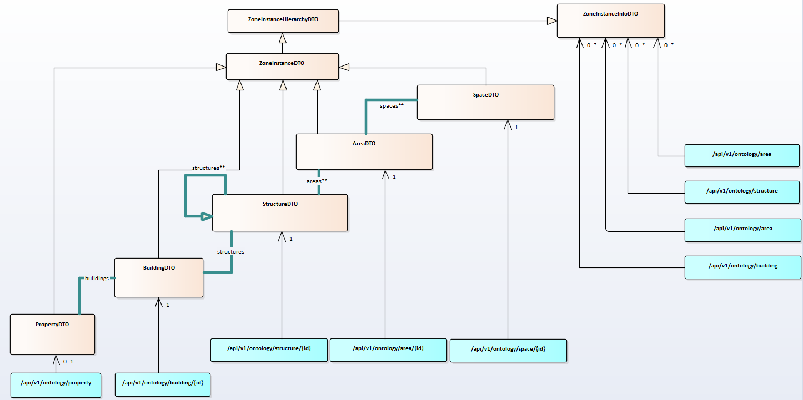

# Sites description: the building infrastructure

## General information

A first route of the API is basically to describe the structure of the property based on objects 

openBOS&reg; describes a single site basically named Property. A Property is composed of a collection of buildings. 

Each building is a collection of structure (roof, façade, floors, parking, …. ) but also a collection of physical spaces in structures (Office, corridor, …) and logical areas (department, …).  

In openBOS&reg; ontology, in fact all these objects are zone, either physical or logical, with the concept of the Zone in Zone concept. A Space or a Area may include one or a collection of Spaces and Areas.  

A physical Space may then be a Space of a Structure. Both have additional information than logical zones: coordinate, size, physical description.  

A Structure is a specific Space that cannot be resized because a part of the building structure: a floor, a parking, a basement, a roof, … Moreover, a Structure comes with a graphical building layout in the ontology.  

All element describing the property (Building, Structure, Space, Area) is a Zone and refers to a Zone template. openBOS&reg; is indeed natively designed over templates.

## Ontology mapping

## Predefined tags

Associated standard tags for structures:
As mentioned before everything is a zone and these roles may be found by tags: You can search a zone using the associated tag.

| Tag  | Space name  | Description  | Array JSon  Name | Where it can be used | Property    |
|--|-|--|--|--|---|
|  | |  |  |  |   |
| bos:property | Site  | Identifies a structural space as site  | ##structuralSpaces | ZoneInstance | bos:info:address:address1 bos:info:address:address2 bos:info:address:town bos:info:address:country bos:info:GPSlat bos:info:GPSIon bos:info:surface_gross bos:info:people bos:site:type:xxxx bos:structure:usage:xxxx |
| bos:building | Building  | Identifies a structural space as building  | ##structuralSpaces | ZoneInstance | bos:info:surface_gross bos:info:surface_net bos:info:people bos:structure:usage:xxxx  |
| bos:structure:floor  | Floor | Identifies a structural space as floor   | ##structuralSpaces | ZoneInstance | bos:info:surface_gross bos:info:surface_net bos:info:people bos:structure:usage:xxxx bos:info:level   |
| bos:structure:roof | Roof  | Identifies a structural space as roof  | ##structuralSpaces | ZoneInstance | bos:info:surface_gross bos:info:surface_net bos:info:people bos:structure:usage:xxxx bos:info:level   |
| bos:structure:facade | Facade  | Identifies a structural space as façade  | ##structuralSpaces | ZoneInstance | bos:info:surface_gross bos:structure:usage:xxxx     |
| bos:structure:ground | Ground  | Identifies a structural space as ground  | ##structuralSpaces | ZoneInstance | bos:info:surface_gross bos:info:surface_net bos:info:people bos:structure:usage:xxxx bos:info:level=0   |
| bos:structure:basement | Basement  | Identifies a structural space as basement  | ##structuralSpaces | ZoneInstance | bos:info:surface_gross bos:info:surface_net bos:info:people bos:structure:usage:xxxx bos:info:level   |
| bos:structure:parking  | Parking | Identifies a structural space as parking   | ##structuralSpaces | ZoneInstance | bos:info:surface_gross bos:info:surface_net bos:info:people bos:structure:usage:xxxx bos:info:level   |
| bos:structure:exterior | Exterior  | Identifies a structural space as exterior  | ##structuralSpaces | ZoneInstance | bos:info:surface_gross bos:info:surface_net bos:info:people bos:structure:usage:xxxx bos:info:level   |
| bos:space:area:lobby | Lobby | Identifies a space as an area of type lobby  | ##physicalSpaces | ZoneInstance | bos:info:indoor_outdoor   |
| bos:space:area:entrance  | Entrance  | Identifies a space as an area of type entrance | ##physicalSpaces | ZoneInstance | bos:info:indoor_outdoor   |
| bos:space:area:commercial_area | Commercial Area | Identifies a space as a commercial area such as a retail space | ##physicalSpaces | ZoneInstance | bos:info:indoor_outdoor   |
| bos:space:area:dining_area | Dining Area | Identifies a space as a dining area  | ##physicalSpaces | ZoneInstance | bos:info:indoor_outdoor   |
| bos:space:area:atrium  | Atrium  | Identifies a space as an atrium usually involving  skylight and generous glazing areas  | ##physicalSpaces | ZoneInstance | bos:info:indoor_outdoor   |
| bos:space:area:coworking | Coworking | Identifies a space as a coworking area   | ##physicalSpaces | ZoneInstance | bos:info:indoor_outdoor   |
| bos:space:area:waiting_hall  | Waiting hall  | Identifies a space as a waiting area,  like in a railway station, airport or bus station  | ##physicalSpaces | ZoneInstance | bos:info:indoor_outdoor   |
| bos:space:area:warehouse | Warehouse | Identifies a space as a warehouse area   | ##physicalSpaces | ZoneInstance | bos:info:indoor_outdoor   |
| bos:space:area:library | Library | Identifies a space as a library used to store papers , documents, books, films etc. | ##physicalSpaces | ZoneInstance | bos:info:indoor_outdoor   |
| bos:space:area:reception | Reception | Identifies a space as a reception  | ##physicalSpaces | ZoneInstance | bos:info:indoor_outdoor   |
| bos:space:area:worship | Worship area  | Identifies a space as a place of worship for devotion,  prayer or meditation,  small services and counseling services  |  |  |   |
| bos:space:area:lounge  | Lounge  | Identifies a space as a lounge for relaxing or waiting |  |  |   |
| bos:space:room:office  | Office  | Identifies a space as a room of type office  | ##physicalSpaces | ZoneInstance | bos:info:indoor_outdoor   |
| bos:space:room:meeting_room  | Meeting Room  | Identifies a space as a room of type meeting room  | ##physicalSpaces | ZoneInstance | bos:info:indoor_outdoor   |
| bos:space:room:hotel_room  | Hotel Room  | Identifies a space as a room of type hotel room  | ##physicalSpaces | ZoneInstance | bos:info:indoor_outdoor   |
| bos:space:room:bathroom  | Bathroom  | Identifies a space as a bathroom for residential areas,  which may include a toilet |  |  |   |
| bos:space:room:restroom  | Restroom  | Identifies a space as a restroom for commercial areas,  providing toilets and lavatories  | ##physicalSpaces | ZoneInstance | bos:info:indoor_outdoor   |
| bos:space:room:kitchen | Kitchen | Identifies a space as a room of type kitchen | ##physicalSpaces | ZoneInstance | bos:info:indoor_outdoor   |
| bos:space:room:laundry | Laundry | Identifies a space as a room of type laundry room  |  |  |   |
| bos:space:room:locker  | Locker  | Identifies a space as a room of type locker room |  |  |   |
| bos:space:room:class | Classroom | Identifies a space as a room of type classroom |  |  |   |
| bos:space:room:controlroom | Controlroom | Identifies a space as a room of type controlroom |  |  |   |
| bos:space:room:courtroom | Courtroom | Identifies a space as a room of type courtroom |  |  |   |
| bos:space:room:cloakroom | Cloakroom | Identifies a space as a room of type cloakroom |  |  |   |
| bos:space:room:cloakroom | Showroom  | Identifies a space as a showroom   |  |  |   |
| bos:space:room:waiting_room  | Waiting room  | Identifies a space as a waiting room like in a doctor's office |  |  |   |
| bos:space:room:storage | Storage | Identifies a space as a general storage space for merchandise,  materials, equipment or paper with no particular HVAC needs |  |  |   |
| bos:space:exterior:terrace | Terrace | Identifies a space as an exterior of type terrace  | ##physicalSpaces | ZoneInstance | bos:info:indoor_outdoor   |
| bos:space:exterior:garden  | Garden  | Identifies a space as an exterior of type garden | ##physicalSpaces | ZoneInstance | bos:info:indoor_outdoor   |
| bos:space:exterior:forecourt | Forecourt | Identifies a space as an exterior of type forecourt  | ##physicalSpaces | ZoneInstance | bos:info:indoor_outdoor   |
| bos:space:exterior:patio | Patio | Identifies a space as an exterior of type patio  | ##physicalSpaces | ZoneInstance | bos:info:indoor_outdoor   |
| bos:space:exterior:courtyard | Courtyard | Identifies a space as an exterior of type courtyard  | ##physicalSpaces | ZoneInstance | bos:info:indoor_outdoor   |
| bos:space:space:parking  | Parking Standard  | Identifies a space as a parking of type standard parking | ##physicalSpaces | ZoneInstance | bos:info:indoor_outdoor   |
| bos:space:parking:parking_standard | Parking Standard  | Identifies a space as a parking of type standard parking | ##physicalSpaces | ZoneInstance | bos:info:indoor_outdoor   |
| bos:space:parking:parking_EV | Parking for Electrical Vehicles | Identifies a space as a parking of type parking  for electrical vehicles  | ##physicalSpaces | ZoneInstance | bos:info:indoor_outdoor   |
| bos:space:parking:parking_disabled | Parking Disabled  | Identifies a space as a parking of type parking  for disabled people  | ##physicalSpaces | ZoneInstance | bos:info:indoor_outdoor   |
| bos:space:circulation:corridor | Corridor  | Identifies a space as a circulation of type corridor | ##physicalSpaces | ZoneInstance | bos:info:indoor_outdoor   |
| bos:space:circulation:staircase  | Staircase | Identifies a space as a circulation of type staircase  | ##physicalSpaces | ZoneInstance | bos:info:indoor_outdoor   |
| bos:space:circulation:hallway  | Hallway | Identifies a space as a circulation of type hallway  | ##physicalSpaces | ZoneInstance | bos:info:indoor_outdoor   |
| bos:space:circulation:exit_passage | Exit Passage  | Identifies a space as a circulation of type exit passage | ##physicalSpaces | ZoneInstance | bos:info:indoor_outdoor   |
| bos:space:circulation:elevator | Elevator  | Identifies a space as a circulation of type elevator | ##physicalSpaces | ZoneInstance | bos:info:indoor_outdoor   |
| bos:space:circulation:walkway  | Walkway | Identifies a space as a circulation of type walway | ##physicalSpaces | ZoneInstance | bos:info:indoor_outdoor   |
| bos:space:circulation:escalator  | Escalator | Identifies a space as a circulation of type escalator  | ##physicalSpaces | ZoneInstance | bos:info:indoor_outdoor   |
| bos:space:technical:electrical_cabinet | Electrical Cabinet  | Identifies a technical space as an electrical cabinet  | ##technicalSpaces  | ZoneInstance | bos:info:indoor_outdoor   |
| bos:space:technical:IT_bay | IT Bay  | Identifies a technical space as an IT bay  | ##technicalSpaces  | ZoneInstance | bos:info:indoor_outdoor   |
| bos:space:technical:technical_room | Technical Room  | Identifies a technical space as a technical room | ##technicalSpaces  | ZoneInstance | bos:info:indoor_outdoor   |
| bos:space:technical:technical_area | Technical Area  | Identifies a technical space as a technical area | ##technicalSpaces  | ZoneInstance | bos:info:indoor_outdoor   |
| bos:space:technical:dry_riser  | Dry Riser | Identifies a technical space as a dry riser  | ##technicalSpaces  | ZoneInstance | bos:info:indoor_outdoor   |
| bos:space:technical:cables_raceway | Cables Raceway  | Identifies a technical space as a cables raceway | ##technicalSpaces  | ZoneInstance | bos:info:indoor_outdoor   |
| bos:space:technical:server_room  | Server room | Identifies a technical space as server room  |  |  |   |
| bos:space:technical:data_room  | Data room | Identifies a technical space as data room  |  |  |   |
| bos:space:technical:electrical_room  | Electrical room | Identifies a technical space as electrical room  |  |  |   |
| bos:space:technical:electrical_room  | Mechanical room | Identifies a technical space as mechanical room  |
