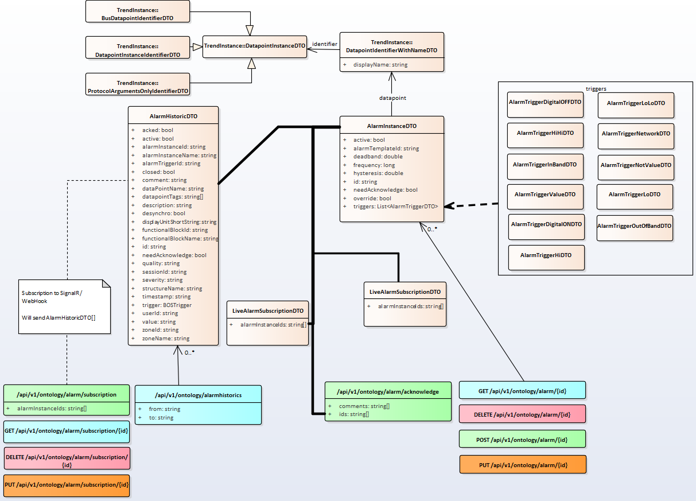

# Automation functions - Alarming

openBOS® manages automation functions such as alarming. 

An alarm compares the value from a fieldbus variable with the conditions of the alarm and generates an event if the conditions are fulfilled.  

The alarm can be sent in an event-driven manner using SignalR or Webhook.

## Alarms

