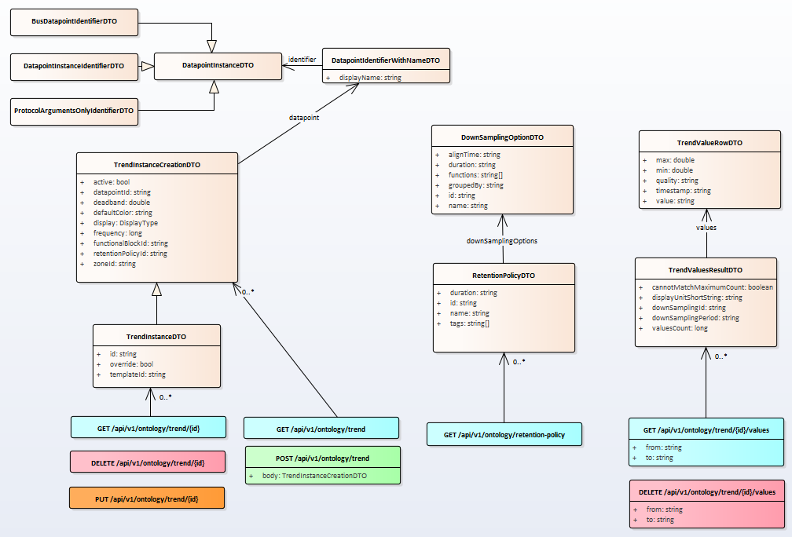

# Automation functions - Trending

openBOS® manages automation functions such as trending. 

A trend is a log of values with their respective timestamps of a physical datapoint coming from a sensor. Values are stored with a time frequency acquisition. 

Trends are stored in database on the edge. 

## Trends

