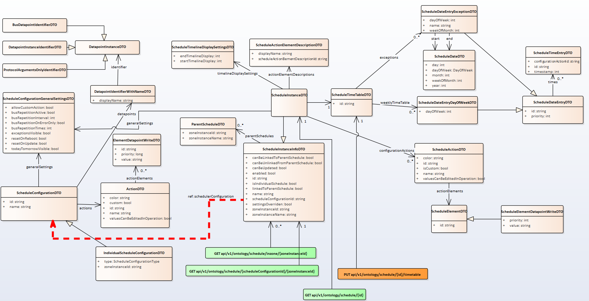

# Automation functions - Scheduling

openBOS® manages scheduling. 

Schedulers are launching actions according to timetables per day, per week, … with exception and depending on a calendar 
In openBOS schedulers are organized and hierarchical per ZONE: a SCHEDULER of a STRUCTURE will of course propagate the SCEDULERS to all the SPACES and AREAS of the STRUCTURE. But User may override a specific SPACE schedule. 
These automation functions may be linked to a STRUCTURE, a SPACE or an AREA. 

openBOS offers a collection of route to manage these automation functions to developers. 

Schedules may be hierarchical depending on the building structure hierarchy. A schedule may be at floor level and also at room level and there is a hierarchy between these schedules 

If you apply a schedule on a floor (parent zone) then it will apply to all the spaces of the floor. But a local schedule for a specific space of that floor may override the parent one of the floor 

## Scheduler

